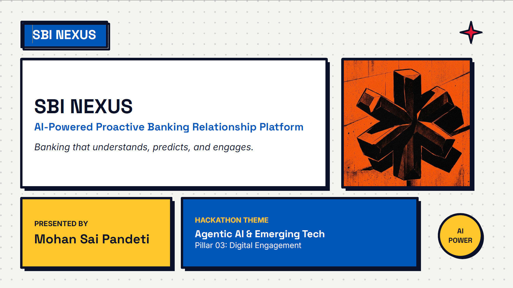

<div align="center">

#  SBI Nexus
### AI-Powered Proactive Banking Relationship Platform

### *"Banking that understands, predicts, and engages."*


---

**SBI Hackathon @ Global Fintech Fest 2026**

**Theme:** Agentic AI & Emerging Technologies

**Problem Statement:** Digital Engagement

---

[Overview](#overview) •
[Presentation](#presentation-deck) •
[Features](#features) •
[Architecture](#system-architecture) •
[Tech Stack](#technology-stack) •
[Roadmap](#project-roadmap) •
[Developer](#developer)

</div>

---

##  Overview

Traditional banking systems are largely **reactive**, requiring customers to initiate interactions, search for services, monitor spending, and manage finances independently.

This often results in:

- Missed savings opportunities
- Poor financial awareness
- Delayed fraud detection
- Low customer engagement
- Generic product recommendations

## SBI Nexus changes this paradigm.

Instead of waiting for customers to ask,

**SBI Nexus proactively understands customer behavior and delivers personalized financial assistance before customers even realize they need it.**

Think of it as an **AI Relationship Manager** that continuously analyzes spending habits, predicts financial needs, recommends relevant SBI products, and assists customers through multilingual conversational AI.

---


##  Presentation Deck

<p align="center">
  
</p>

<p align="center">
  <a href="docs/SBI_NEXUS_Presentation.pdf">
    <strong> View Full Presentation (PDF)</strong>
  </a>
</p>

> Complete solution overview, architecture, implementation roadmap, and business impact.
---
##  Problem Statement

Banks today struggle with:

- Low digital engagement
- Information overload
- High customer support workload
- Delayed fraud awareness
- Generic product recommendations
- Weak customer retention

Current banking applications focus primarily on transactions rather than long-term financial guidance.

---

##  Proposed Solution

SBI Nexus is an **AI-Powered Proactive Banking Relationship Platform** designed to enhance customer engagement through intelligent financial assistance.

Rather than functioning as another chatbot,

SBI Nexus continuously analyzes:

- Spending patterns
- Financial goals
- Transaction history
- Behavioral insights
- Banking activities

to generate **real-time personalized financial recommendations**.

---

##  Features

##  Smart Spending Analytics

- Spending categorization
- Monthly expense trends
- Financial health analysis

---

##  Bill Prediction

Predicts recurring bills

- Electricity
- Internet
- EMI
- Rent
- Credit Cards

with proactive reminders.

---

##  Personalized Banking Products

AI recommends

- Fixed Deposits
- SIPs
- Personal Loans
- Home Loans
- Credit Cards
- Insurance

based on customer behavior.

---

##  AI Financial Coach

Natural language conversations using Gemini AI.

Examples:

> "Can I afford a vacation next month?"

> "Where am I overspending?"

> "Suggest investment options."

---

##  Multilingual AI

Supports multiple Indian languages.

Future support includes:

- English
- Hindi
- Telugu
- Tamil
- Kannada
- Malayalam

---

##  Fraud Awareness

Detects

- unusual transactions
- abnormal spending
- suspicious locations

and alerts customers proactively.

---

##  Financial Health Score

Provides a real-time financial wellness score based on

- Savings
- Investments
- Spending
- Liabilities
- Budget discipline

---

##  System Architecture

```
                    React Frontend
                          │
                          ▼
                 Spring Boot REST APIs
                          │
       ┌──────────────────┼──────────────────┐
       ▼                  ▼                  ▼
 Authentication     Business Logic     AI Engine
       │                  │                  │
       ▼                  ▼                  ▼
 JWT Security      PostgreSQL DB      Gemini API
       │                  │                  │
       └──────────────────┼──────────────────┘
                          ▼
             Personalized Recommendations
                          │
                          ▼
                 Customer Dashboard
```

---

##  Technology Stack

## Frontend

- React.js
- Tailwind CSS
- Axios

---

## Backend

- Java 21
- Spring Boot
- Spring Security
- Spring Data JPA
- REST APIs

---

## Database

- PostgreSQL

---

## AI

- Google Gemini API
- Spring AI
- Rule-Based Recommendation Engine

---

## Authentication

- JWT Authentication

---

## Deployment

- Docker
- Render
- Railway

Future:

- AWS
- Google Cloud Platform

---

## Development

- IntelliJ IDEA
- VS Code
- Git
- GitHub
- Postman

---

##  Repository Structure

```
sbi-nexus/

├── backend/
├── frontend/
├── database/
├── docs/
├── api/
├── diagrams/
├── assets/
├── README.md
├── LICENSE
└── .gitignore
```

---

##  User Journey

1. Customer logs into SBI.
2. AI analyzes recent transactions.
3. Financial Health Score is generated.
4. Smart recommendations appear.
5. Customer interacts using conversational AI.
6. AI suggests banking products.
7. Customer executes recommendations instantly.

---

##  Project Roadmap

## Phase 1

- Project Setup
- Authentication
- Database Design

---

## Phase 2

- Dashboard
- Transactions
- Spending Analytics

---

## Phase 3

- Gemini AI Integration
- AI Recommendation Engine
- Financial Health Score

---

## Phase 4

- Bill Prediction
- Fraud Detection
- Product Recommendation

---

## Phase 5

- Docker Deployment
- Cloud Hosting
- Performance Optimization

---

##  Commercial Potential

SBI Nexus operates as an **Enterprise AI Engagement Layer** integrated directly into SBI's existing banking ecosystem.

Business Benefits:

- Increased customer engagement
- Higher product conversion rates
- Improved customer retention
- Reduced support costs
- Better fraud awareness
- Personalized banking experiences

---

##  Security

Security is a core design principle.

Planned security features include:

- JWT Authentication
- Password Encryption
- Secure REST APIs
- HTTPS
- Role-Based Access Control
- SQL Injection Protection
- XSS Protection
- Input Validation

---


##  Future Scope

- AI Autonomous Financial Planning
- Portfolio Optimization
- Wealth Management
- Voice Banking
- UPI Insights
- Investment Advisor
- Personalized Insurance Advisor
- Cloud-Native Microservices
- AI Agent Automation

---

##  Developer

## Mohan Sai Pandeti

**B.Tech Computer Science & Engineering (Data Science)**


Individual Participant - SBI Hackathon @ GFF 2026

 Email

pandetimohansai@gmail.com

 LinkedIn

https://www.linkedin.com/in/mohansaipandeti/

---

##  Contributions

This project is currently being developed as part of the **SBI Hackathon @ Global Fintech Fest 2026**.

Suggestions, feedback, and discussions are welcome.

---

##  License

This project is licensed under the MIT License.

---

<div align="center">

##  If you like this project, consider giving it a star.

**Built with ❤️ using Spring Boot, React, PostgreSQL & Gemini AI**

</div>
